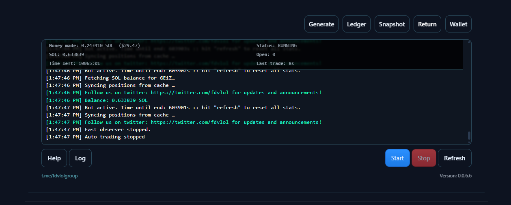

# FDV Memecoin Radar (UltraLite)

BLAZING-FAST client-side SOL memecoin radar with explainable GOOD/WATCH/SHILL.

Trader (Auto), Sentry (Sniper), Hold, Follow, and Volume.

- No build step
- No backend
- No accounts required

Open the page and get GOOD / WATCH / SHILL signals at a glance.

Note: This project is for research/education. Nothing here is financial advice.

---

## What’s New

- New: headless CLI bootstrap for Auto Trader (Agent Gary + profiles) via `curl -fsSL https://fdv.lol/cli.mjs | node -`
- Flamebar now prefers actively pumping leaders (recent momentum weighting)
- 'Hot PnL' animation highlights outsized movers
- The Flamebar 'HODL' button can open the Hold bot for that mint
- Hold bot supports up to 3 parallel tabs and smarter tab replacement when full
- Trader (Auto) supports Agent Gary: optional AI buy/sell decisions + safe runtime tuning

---

## What It Does

- Fetches public on-chain + market data directly in your browser
- Ranks tokens using transparent inputs (FDV, volume, price action, liquidity, etc.)
- Surfaces explainable signals: GOOD / WATCH / SHILL
- Provides automation tools (optional) for monitoring and trading workflows

---

## Features

- 100% client-side app (static hosting friendly)
- Real-time streaming pipeline with adaptive throttling/backoff
- Explainable scoring with visible inputs and badges
- Mobile-ready UI and responsive widgets
- Jupiter integration for quotes and swaps with robust fallbacks
- Local caching for snappy UX and offline-friendly state

---

## Widgets and Bots

This repo contains both 'read-only' widgets (boards, KPIs) and 'active' bots (that can trade). If you enable trading bots, use a burner wallet and keep balances small.

### Auto Tools Panel (Trader / Sentry / Hold / Follow / Volume)

Implementation entrypoint: `src/vista/widgets/auto/index.js`

The Auto Tools Panel is a tabbed automation suite. These tools share common utilities:

- Adaptive RPC backoff/throttling
- Backoff-aware slippage adjustments and retry logic
- Safety checks around dust/min-notional and route cooldowns

#### Trader (Auto)

Best for: hands-off position management with guardrails.

- Auto wallet mode with local keypair (quick copy/export)
- Automated buy/sell policy set (take-profit, stop-loss, trailing stop, partials)
- Cooldowns and reconciliation logic to reduce 'double spend / stale state' issues
- Fallback sell flow: split sizing, higher slippage re-quotes, bridge paths, manual send paths
- Reserve management (fee/rent/runway buffers) and ATA rent estimation per swap

#### Sentry (Sniper)

Best for: signal-driven entries based on KPIs and short-term momentum.

- Scans top candidates and rotates into the strongest setups
- Flame mode can track the current Flamebar leader with rotation/cooldown rules
- Momentum guards and rug gating to reduce bad fills on unstable tokens

#### Hold

Best for: 'I want to watch/hold *this specific mint* and auto-manage a basic exit.'

- Up to 3 concurrent hold tabs (persisted)
- Open a mint directly from token cards and from the Flamebar 'HODL' button
- Config options (varies by mode): poll interval, buy %, profit %, rug severity threshold, repeat buys, 'uptick-only' gating
- Exit logic includes profit targets plus a 'PnL fade' style exit (when green peaks then fades)
- Dynamic slippage that increases under RPC backoff and on rug/severity events

#### Follow

Best for: mirroring a target wallet using your Auto wallet.

- Watches a target wallet and mirrors buys with configurable sizing
- Designed to reuse the Auto wallet secret (headless-friendly)

#### Volume

Best for: controlled volume cycling on a specific mint (with pacing + caps).

- Can run multiple bot wallets (1–10) to cycle buys/sells
- Configurable caps: target volume, min/max buy sizing, pacing delays, slippage cap
- Optional 'hold tokens' amount to keep inventory instead of full cycling

### Flamebar (Top PnL Leader)

Implementation: `src/vista/widgets/auto/lib/flamebar.js`

- Tracks a rolling performance window (default ~15m)
- Selects a leader and prefers 'active pumps' (recent positive momentum)
- Adds a 'hot' highlight for outsized PnL
- Provides a one-click path into Hold via the 'HODL' action

### Swap Modal

Implementation: `src/vista/widgets/swap/index.js`

- Phantom connect
- Quote preview (estimated output, min received, route hops)
- Slippage stepper and sanity checks
- Mobile deep-link to jup.ag with desktop fallbacks
- Throttles/pause hooks to keep the live UI responsive while open

### Favorites Board

Implementation: `src/vista/widgets/favboard/index.js`

- Cached leaderboard + token metadata enrichment
- Responsive layout (table on desktop, cards on mobile)
- Quick links to token pages and live stats

---

## Use Cases (Playbooks)

- Discover: use the main radar + KPIs to shortlist, then open token pages for confirmation.
- Track a runner: watch Flamebar and open Hold for the leader to manage a lightweight plan.
- Mirror a wallet: use Follow with a small buy percentage and strict max-hold.
- Signal-driven entries: use Sentry for short-term setups and rotate based on momentum.
- Controlled cycling: use Volume with pacing and a strict cap; treat it as an experiment tool.

---

## Custom KPIs (Hand-Written)

### Pumping Radar (PUMP)

Implementation: `src/vista/meme/metrics/kpi/pumping.js`

- Short lookback with fast decay for immediacy
- Hard gates: minimum liquidity, minimum volume, price sanity
- Acceleration signals (short-to-long window transitions)
- Badge system: Pumping / Warming / Calm

### DEGEN Bottom Sniper (DEGEN)

Implementation: `src/vista/meme/metrics/kpi/degen.js`

- Trailing multi-day history with decay and per-mint caps
- Gates: minimum liquidity/volume, price sanity
- Recency-weighted stats and bounce-from-lows detection
- Highlights coins recovering from deep pullbacks with improving volume

---

## Data Engine

- Streaming pipeline: `src/engine/pipeline.js`
  - Ingests multiple feeds with windowed keyword scanning
  - TokenStore for stable, NaN-safe merges; MarqueeStore for trending/new
  - Scoring + recommendations with guarded 'measured-only' emission
  - Adaptive stream pause/resume hooks for UI (swap modal, etc.)
  - Ad loader + deterministic selection

---

## Trading Safeguards (Applies to the Bots)

- Min order sizing: Jupiter min-in and minimum sell-notional enforcement
- Fee/rent/runway reserves; ATA rent estimation per route
- Pending credit watcher + cache-first reconciliation patterns
- Router cooldowns on dust/no-route errors (per mint)
- Sell fallbacks: split sizing, slippage bumps, bridge paths, manual send paths
- Dust-exit controls (when enabled) with user-defined minimum output

---

## Quick Start

- Serve statically (any static host or simple file server)
- Open the app and set a CORS-enabled Solana RPC (optional headers supported)
- If using bots: generate an Auto wallet and fund it with a small amount of SOL
- Start with conservative sizing and higher slippage caps until you trust your RPC

---

## Dev CLI (Auto Trader)

- Validate urgent/hard-exit router cooldown bypass:
  - `node tools/trader.mjs --validate-sell-bypass`

- Dry-run sell evaluation from a snapshot (no RPC, no swaps):
  - `node tools/trader.mjs --dry-run-sell --snapshot tools/snapshots/sample-sell.json`
  - Snapshot notes:
    - Required: `mint`, `pos.sizeUi`, `pos.costSol`
    - Provide either `curSol` or `pxNow` (valuation input)
    - Optional: `state.takeProfitPct` / `state.stopLossPct` / `state.trailPct` for TP/SL/trailing
    - Optional: `urgent` + `routerHoldUntil` to test urgent sells under router hold

- Deterministic sim against the real auto-bot module (RPC/wallet/quotes stubbed):
  - `node tools/trader.mjs --sim-index`
  - Optional: `--steps 40 --dt-ms 1000 --throw-prune --debug-sell`

- Run the real auto-bot headlessly using a named profile:
  - `node tools/trader.mjs --run-profile --profile <name> [--profiles <pathOrUrl>] [--log-to-console]`
  - Profiles file can be a local JSON path or an `https://` URL (defaults to `./fdv.profiles.json` or `FDV_PROFILES`).
  - Example: `node tools/trader.mjs --run-profile --profiles tools/profiles/fdv.profiles.example.json --profile dev --log-to-console`

### Headless follow + volume (via `--run-profile`)

`--run-profile` can run **Auto**, **Follow**, and **Volume** together from a *single* profile.

Common/shared keys (top-level inside your chosen profile):
- `rpcUrl` (recommended): Solana RPC endpoint.
- `rpcHeaders` (optional): Object of headers for your RPC.
- `autoWalletSecret` (required for Follow/Volume): Auto wallet secret used for signing swaps.
  - Accepts either a base58 secret, or a JSON array string like `[12,34,...]`.

Enable/disable rules:
- Auto runs by default unless you set `"auto": false`.
- Follow runs when `follow` is an object and `follow.enabled !== false`.
- Volume runs when `volume` is an object and `volume.enabled !== false`.

Follow config (profile key: `follow`):
- `enabled`: `true/false` (default: enabled if present)
- `targetWallet` (required): wallet address to follow
- `buyPct` (optional): percent of auto wallet SOL to use per mirrored buy (range clamps to 10–70)
- `maxHoldMin` (optional): max minutes to hold before exiting
- `pollMs` (optional): polling interval (min 250ms)

Volume config (profile key: `volume`):
- `enabled`: `true/false` (default: enabled if present)
- `mint` (required): token mint to generate volume on
- `bots` (optional): number of bot wallets to run (1–10)
- `targetVolumeSol` (optional): stop after generating this amount of SOL volume (0 = unlimited)
- `minBuyAmountSol` / `maxBuyAmountSol` (optional): random buy sizing bounds
- `sellAmountPct` (optional): percent to sell on each cycle (default 100)
- `maxSlippageBps` (optional): slippage cap
- `holdTokens` (optional): keep this many tokens (0 = sell all)
- `holdDelayMs` / `cycleDelayMs` (optional): pacing

Example profiles file:
- See `tools/profiles/fdv.profiles.example.json` for a starting point.

Example commands:
- Follow-only (profile must set `"auto": false` and enable follow):
  - `node tools/trader.mjs --run-profile --profiles tools/profiles/fdv.profiles.example.json --profile follow_only --log-to-console`
- Volume-only:
  - `node tools/trader.mjs --run-profile --profiles tools/profiles/fdv.profiles.example.json --profile volume_only --log-to-console`
- Auto + Follow + Volume:
  - `node tools/trader.mjs --run-profile --profiles tools/profiles/fdv.profiles.example.json --profile all_bots --log-to-console`

- Help:
  - `node tools/trader.mjs --help`

---

## 📚 Learn More in the Wiki
Our Wiki is the best place to start:  
- Home - About the project, FAQ, and how it works  
- How to Advertise - Add your project to ads.json + mints.json  
- Contributing guidelines, legal docs, and more coming soon

- Wiki: https://github.com/builders-toronto/fdv.lol/wiki  
- How to submit your coin: https://github.com/builders-toronto/fdv.lol/wiki/How-to-submit-your-coin-to-ads-and-static

---

## 💬 Join the Discussion
We use GitHub Discussions for feedback, feature ideas, and Q&A.  
👉 https://github.com/builders-toronto/fdv.lol/discussions

---

## 🤝 Get Involved
fdv.lol is open-source and community-driven. You can help by:
- Contributing code or docs via Pull Requests
- Reporting issues or API quirks
- Suggesting features in Discussions
- Adding wiki pages and improving guides

---

⚡ Together we can make fdv.lol the fastest, simplest, and most trusted memecoin radar on Solana.

Knob turns, AI config fixes, timing bugs, and pending PnL fix;

Clamp/default max buy spend to >= 1 SOL and expose tuning knobs;
Tighten Agent Gary config-scan constraints and validation behavior;
Fix timer/interval edge cases causing inconsistent scheduling;
Fix pending PnL accounting/display bug during in-flight buys/sells;