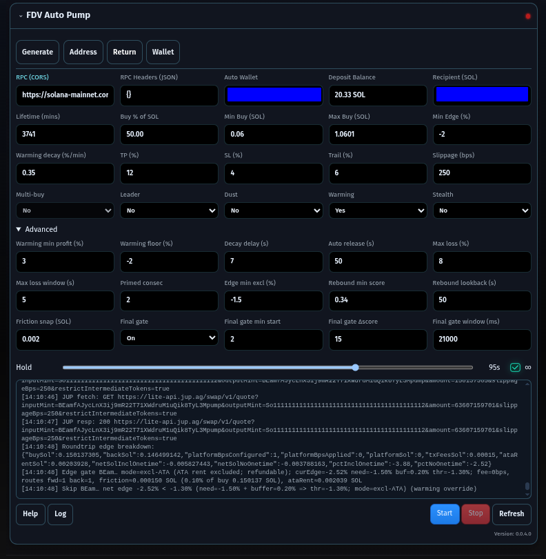

# 🐸 FDV Memecoin Radar - UltraLite

A tiny, client-side Solana memecoin radar.  
No build step. No backend. No data hoarding.  
Just open the page and get GOOD / WATCH / SHILL signals at a glance.

---

## 🚀 What It Does
- Fetches public on-chain and market data directly in your browser
- Ranks tokens by FDV, volume, and traction
- Surfaces trending memecoins worth following
- Provides explainable badges: GOOD · WATCH · SHILL
- Uses a variety of custom made widgets to accelerate the users MEME expertise and growth.

---

## ✨ Features

- 100% client-side UltraLite app (static hosting friendly)
- Real-time streaming pipeline with adaptive throttling/backoff
- Explainable scoring with transparent inputs and badges
- Mobile-ready UI components and responsive widgets
- Jupiter integration for quotes and swaps with robust fallbacks
- Local caching for snappy UX and offline-friendly state

---

## 🧩 Widgets

- Auto Pump (src/vista/widgets/auto.js)
  - Auto wallet mode with local keypair, quick copy/export
  - Router/dust protections: min-notional buy/sell, cooldowns, pending credit reconciliation
  - Leader mode: rotate to top pumper; optional multi-buys with batching
  - Position cache + graceful pending-credit sync to avoid race conditions
  - Sell logic: TP/SL, trailing stop, partials, staleness, max/min hold, dust-exit toggle
  - Fallback flow: split-sells, higher slippage re-quotes, USDC bridge sell, manual v0 send
  - Reserve management: fee/rent/runway buffers, ATA rent estimation per swap
  - Integrated wallet menu: SOL total, sellable vs dust by Jupiter’s min-notional

- Swap Modal (src/vista/widgets/swap.js)
  - Phantom connect, programmatic sign, session verification (PoW) via Turnstile proxy
  - Quote preview: est output, min-received, route hops, slippage bps stepper
  - Fee routing via fee ATAs (ExactIn), sanity checks on-chain
  - Mobile deep-link to jup.ag; desktop Dex link fallback
  - Accessible modal, keyboard-safe on mobile, and throttles the live stream while open

- Favorites Board (src/vista/widgets/favboard.js)
  - Fan-fav leaderboard with cached fetch + token metadata enrichment
  - Responsive card-style layout on mobile
  - Quick links to token pages and live stats

---

## 📈 Custom KPIs (hand-written)

- Pumping Radar (PUMP) (src/vista/meme/addons/pumping.js)
  - Short lookback with fast decay for immediacy
  - Hard gates: min liquidity, 1h volume, price sanity
  - Acceleration signals: 5m→1h, 1h→6h, z-scored 1h volume surprise
  - Breakout vs recent lows, liquidity scaling, buy pressure boost
  - Badge system: 🔥 Pumping · Warming · Calm

- DEGEN Bottom Sniper (DEGEN) (src/vista/meme/addons/degen.js)
  - Trailing 3-day history with decay and per-mint caps
  - Gates: min liquidity/volume, price sanity
  - Recency-weighted stats (decayed mean/std), bounce from local lows, cheapness factor
  - Highlights coins recovering from deep pullbacks with improving volume

---

## ⚙️ Data Engine

- Streaming pipeline (src/engine/pipeline.js)
  - Ingests multiple feeds with windowed keyword scanning
  - TokenStore for stable, NaN-safe merges; MarqueeStore for “Trending/New”
  - Scoring + recommendations with guarded “measured-only” emission
  - Adaptive stream pause/resume hooks for UI (swap modal, etc.)
  - Ad loader + deterministic selection

---

## 🛡️ Trading Safeguards (Auto Pump)

- Min order sizing: Jupiter min-in and min sell-notional enforcement
- Fee/rent/runway reserves; ATA rent estimated per route
- Pending credit watcher + cache-first reconciliation
- Router cooldown on dust/no-route errors (per-mint)
- Sell fallbacks: split sizing, slippage bumps, USDC bridge, manual v0 send
- Dust-exit toggle with user-defined min SOL out

---

## 🔧 Config Highlights

- swap.js CFG
  - jupiterBase, rpcUrl, auth/turnstile, platformFeeBps
  - fee ATAs per mint, tokenDecimals hints
  - Builders to construct Dex/Jupiter URLs for mobile/desktop

---

## 🧪 Quick Start

- Serve statically (any static host or simple file server)
- Open the app, set a CORS-enabled RPC (header JSON supported)
- Generate auto wallet, fund with SOL (recommend at least ~$7)
- Set Recipient for “End & Return”, tune Buy %, Min/Max, Slippage
- Start Auto Pump; monitor log and wallet menu

---

## 📚 Learn More in the Wiki
Our Wiki is the best place to start:  
- Home - About the project, FAQ, and how it works  
- How to Advertise - Add your project to ads.json + mints.json  
- Contributing guidelines, legal docs, and more coming soon

- Wiki: https://github.com/builders-toronto/fdv.lol/wiki  
- How to submit your coin: https://github.com/builders-toronto/fdv.lol/wiki/How-to-submit-your-coin-to-ads-and-static

---

## 💬 Join the Discussion
We use GitHub Discussions for feedback, feature ideas, and Q&A.  
👉 https://github.com/builders-toronto/fdv.lol/discussions

---

## 🤝 Get Involved
fdv.lol is open-source and community-driven. You can help by:
- Contributing code or docs via Pull Requests
- Reporting issues or API quirks
- Suggesting features in Discussions
- Adding wiki pages and improving guides

---

⚡ Together we can make fdv.lol the fastest, simplest, and most trusted memecoin radar on Solana.

fix(ipfs): dev localhost silencing; intercept IMG; skip probes to stop DNS spam; efactor start; scrolling mount with fixed baseline