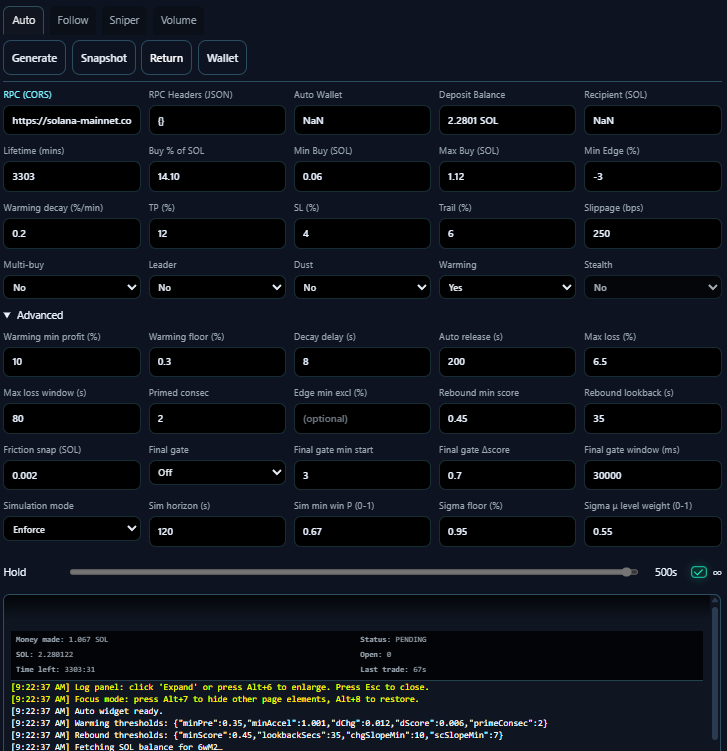

# 🐸 FDV Memecoin Radar - UltraLite

A tiny, client-side Solana memecoin radar.  
No build step. No backend. No data hoarding.  
Just open the page and get GOOD / WATCH / SHILL signals at a glance.

---

## 🚀 What It Does
- Fetches public on-chain and market data directly in your browser
- Ranks tokens by FDV, volume, and traction
- Surfaces trending memecoins worth following
- Provides explainable badges: GOOD · WATCH · SHILL
- Uses a variety of custom made widgets to accelerate the users MEME expertise and growth.

---

## ✨ Features

- 100% client-side UltraLite app (static hosting friendly)
- Real-time streaming pipeline with adaptive throttling/backoff
- Explainable scoring with transparent inputs and badges
- Mobile-ready UI components and responsive widgets
- Jupiter integration for quotes and swaps with robust fallbacks
- Local caching for snappy UX and offline-friendly state

---

## 🧩 Widgets

- Auto Pump (src/vista/widgets/auto.js)
  - Auto wallet mode with local keypair, quick copy/export
  - Router/dust protections: min-notional buy/sell, cooldowns, pending credit reconciliation
  - Leader mode: rotate to top pumper; optional multi-buys with batching
  - Position cache + graceful pending-credit sync to avoid race conditions
  - Sell logic: TP/SL, trailing stop, partials, staleness, max/min hold, dust-exit toggle
  - Fallback flow: split-sells, higher slippage re-quotes, USDC bridge sell, manual v0 send
  - Reserve management: fee/rent/runway buffers, ATA rent estimation per swap
  - Integrated wallet menu: SOL total, sellable vs dust by Jupiter’s min-notional

- Swap Modal (src/vista/widgets/swap.js)
  - Phantom connect, programmatic sign, session verification (PoW) via Turnstile proxy
  - Quote preview: est output, min-received, route hops, slippage bps stepper
  - Fee routing via fee ATAs (ExactIn), sanity checks on-chain
  - Mobile deep-link to jup.ag; desktop Dex link fallback
  - Accessible modal, keyboard-safe on mobile, and throttles the live stream while open

- Favorites Board (src/vista/widgets/favboard.js)
  - Fan-fav leaderboard with cached fetch + token metadata enrichment
  - Responsive card-style layout on mobile
  - Quick links to token pages and live stats

---

## 📈 Custom KPIs (hand-written)

- Pumping Radar (PUMP) (src/vista/meme/addons/pumping.js)
  - Short lookback with fast decay for immediacy
  - Hard gates: min liquidity, 1h volume, price sanity
  - Acceleration signals: 5m->1h, 1h->6h, z-scored 1h volume surprise
  - Breakout vs recent lows, liquidity scaling, buy pressure boost
  - Badge system: 🔥 Pumping · Warming · Calm

- DEGEN Bottom Sniper (DEGEN) (src/vista/meme/addons/degen.js)
  - Trailing 3-day history with decay and per-mint caps
  - Gates: min liquidity/volume, price sanity
  - Recency-weighted stats (decayed mean/std), bounce from local lows, cheapness factor
  - Highlights coins recovering from deep pullbacks with improving volume

---

## ⚙️ Data Engine

- Streaming pipeline (src/engine/pipeline.js)
  - Ingests multiple feeds with windowed keyword scanning
  - TokenStore for stable, NaN-safe merges; MarqueeStore for “Trending/New”
  - Scoring + recommendations with guarded “measured-only” emission
  - Adaptive stream pause/resume hooks for UI (swap modal, etc.)
  - Ad loader + deterministic selection

---

## 🛡️ Trading Safeguards (Auto Pump)

- Min order sizing: Jupiter min-in and min sell-notional enforcement
- Fee/rent/runway reserves; ATA rent estimated per route
- Pending credit watcher + cache-first reconciliation
- Router cooldown on dust/no-route errors (per-mint)
- Sell fallbacks: split sizing, slippage bumps, USDC bridge, manual v0 send
- Dust-exit toggle with user-defined min SOL out

---

## 🔧 Config Highlights

- swap.js CFG
  - jupiterBase, rpcUrl, auth/turnstile, platformFeeBps
  - fee ATAs per mint, tokenDecimals hints
  - Builders to construct Dex/Jupiter URLs for mobile/desktop

---

## 🧪 Quick Start

- Serve statically (any static host or simple file server)
- Open the app, set a CORS-enabled RPC (header JSON supported)
- Generate auto wallet, fund with SOL (recommend at least ~$7)
- Set Recipient for “End & Return”, tune Buy %, Min/Max, Slippage
- Start Auto Pump; monitor log and wallet menu

---

## 🧰 Dev CLI (auto trader)

- Validate urgent/hard-exit router cooldown bypass:
  - `node tools/trader.mjs --validate-sell-bypass`

- Dry-run sell evaluation from a snapshot (no RPC, no swaps):
  - `node tools/trader.mjs --dry-run-sell --snapshot tools/snapshots/sample-sell.json`
  - Snapshot notes:
    - Required: `mint`, `pos.sizeUi`, `pos.costSol`
    - Provide either `curSol` or `pxNow` (valuation input)
    - Optional: `state.takeProfitPct` / `state.stopLossPct` / `state.trailPct` for TP/SL/trailing
    - Optional: `urgent` + `routerHoldUntil` to test urgent sells under router hold

- Deterministic sim against the real auto-bot module (RPC/wallet/quotes stubbed):
  - `node tools/trader.mjs --sim-index`
  - Optional: `--steps 40 --dt-ms 1000 --throw-prune --debug-sell`

- Run the real auto-bot headlessly using a named profile:
  - `node tools/trader.mjs --run-profile --profile <name> [--profiles <pathOrUrl>] [--log-to-console]`
  - Profiles file can be a local JSON path or an `https://` URL (defaults to `./fdv.profiles.json` or `FDV_PROFILES`).
  - Example: `node tools/trader.mjs --run-profile --profiles tools/profiles/fdv.profiles.example.json --profile dev --log-to-console`

### Headless follow + volume (via `--run-profile`)

`--run-profile` can run **Auto**, **Follow**, and **Volume** together from a *single* profile.

Common/shared keys (top-level inside your chosen profile):
- `rpcUrl` (recommended): Solana RPC endpoint.
- `rpcHeaders` (optional): Object of headers for your RPC.
- `autoWalletSecret` (required for Follow/Volume): Auto wallet secret used for signing swaps.
  - Accepts either a base58 secret, or a JSON array string like `[12,34,...]`.

Enable/disable rules:
- Auto runs by default unless you set `"auto": false`.
- Follow runs when `follow` is an object and `follow.enabled !== false`.
- Volume runs when `volume` is an object and `volume.enabled !== false`.

Follow config (profile key: `follow`):
- `enabled`: `true/false` (default: enabled if present)
- `targetWallet` (required): wallet address to follow
- `buyPct` (optional): percent of auto wallet SOL to use per mirrored buy (range clamps to 10–70)
- `maxHoldMin` (optional): max minutes to hold before exiting
- `pollMs` (optional): polling interval (min 250ms)

Volume config (profile key: `volume`):
- `enabled`: `true/false` (default: enabled if present)
- `mint` (required): token mint to generate volume on
- `bots` (optional): number of bot wallets to run (1–10)
- `targetVolumeSol` (optional): stop after generating this amount of SOL volume (0 = unlimited)
- `minBuyAmountSol` / `maxBuyAmountSol` (optional): random buy sizing bounds
- `sellAmountPct` (optional): percent to sell on each cycle (default 100)
- `maxSlippageBps` (optional): slippage cap
- `holdTokens` (optional): keep this many tokens (0 = sell all)
- `holdDelayMs` / `cycleDelayMs` (optional): pacing

Example profiles file:
- See `tools/profiles/fdv.profiles.example.json` for a starting point.

Example commands:
- Follow-only (profile must set `"auto": false` and enable follow):
  - `node tools/trader.mjs --run-profile --profiles tools/profiles/fdv.profiles.example.json --profile follow_only --log-to-console`
- Volume-only:
  - `node tools/trader.mjs --run-profile --profiles tools/profiles/fdv.profiles.example.json --profile volume_only --log-to-console`
- Auto + Follow + Volume:
  - `node tools/trader.mjs --run-profile --profiles tools/profiles/fdv.profiles.example.json --profile all_bots --log-to-console`

- Help:
  - `node tools/trader.mjs --help`

---

## 📚 Learn More in the Wiki
Our Wiki is the best place to start:  
- Home - About the project, FAQ, and how it works  
- How to Advertise - Add your project to ads.json + mints.json  
- Contributing guidelines, legal docs, and more coming soon

- Wiki: https://github.com/builders-toronto/fdv.lol/wiki  
- How to submit your coin: https://github.com/builders-toronto/fdv.lol/wiki/How-to-submit-your-coin-to-ads-and-static

---

## 💬 Join the Discussion
We use GitHub Discussions for feedback, feature ideas, and Q&A.  
👉 https://github.com/builders-toronto/fdv.lol/discussions

---

## 🤝 Get Involved
fdv.lol is open-source and community-driven. You can help by:
- Contributing code or docs via Pull Requests
- Reporting issues or API quirks
- Suggesting features in Discussions
- Adding wiki pages and improving guides

---

⚡ Together we can make fdv.lol the fastest, simplest, and most trusted memecoin radar on Solana.

fix: polish styling and fix IPFS compression blob handling